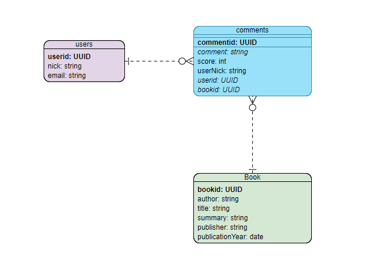

<h1 align="center">Práctica 3. Serverless 👨🏻‍💻 </h1>

<p align="center">
  <a href="/docs" target="_blank">
    
  </a>
  <a href="#" target="_blank">
    
  </a>
</p>

Proyecto para crear una aplicación Serverless en AWS con funciones lambda.

## Authors

👤 **JuanCBM**: Juan Carlos Blázquez Muñoz

* Github: [@JuanCBM](https://github.com/JuanCBM)

👤 **mahuerta**: Miguel Ángel Huerta Rodríguez

* Github: [@mahuerta](https://github.com/mahuerta)

# Sobre la ejecución de la aplicación
- Estructura:

<p align="center">
  
</p>

Como se puede comprobar hemos optado por un diagrama parecido a lo que se podría realizar en una BBDD relacional de MYSQL con **3 tablas**.

Hemos añadido el ``userNick`` en la tabla de comments porque, a pesar de tener redundancia, nos permite retornar el nombre de la persona que ha escrito el comentario. Además, al ser un dato que no se puede actualizar (sólo se actualiza el e-mail) no nos provoca más problemas.

Hemos optado por utilizar **2 funciones lambda**:
- **booksFunction**: Dispone de políticas con permiso de lectura actualización, borrado y creación de la tabla de libros y comentarios. Además, de consulta de usuarios.
- **usersFunction**: Dispone de políticas con permiso de lectura actualización, borrado y creación de la tabla de usuarios. Además, de consulta de libros y comentarios.


# Despliegue
1. Desde la consola en la raíz del proyecto, nos situamos en la carpeta de aws:
    ```
    cd /aws
    ```

2. Construcción y despliegue:
    ```
    sam build
    sam deploy --guided
    ```
3. Siguiendo los pasos dispondremos de la ruta de la aplicación en producción en: 

    https://``${ServerlessRestApi}``.execute-api.``${AWS::Region}``.amazonaws.com/prod/"

# Peticiones 
Adjuntamos un archivo postman con las diferentes peticiones que podemos realizar a la aplicación.

Vamos a hacer un ejemplo de alguna de las más importantes pasando por las operaciones especiales más algunas de los CRUD básicos.

## Operaciones especiales

- ### Obtener el listado de libros en el que se muestre únicamente el título y el id.
    Con unos libros dados de alta, ejecutamos la siguiente petición:

    | verb | url                                 |
    |------|-------------------------------------|
    | GET | https://g286k7v4s3.execute-api.us-east-1.amazonaws.com/prod/books/ |

    Respuesta:
    ```


    ```

-  ### Obtener un único libro con los comentarios asociados. En los comentarios deberá incluirse el nombre del usuario.
    Con un libro dado de alta con comentarios ejecutamos la siguiente petición:

    | verb | url                                 |
    |------|-------------------------------------|
    | GET | 
    https://g286k7v4s3.execute-api.us-east-1.amazonaws.com/prod/books/4f0a91e0-bb2c-11eb-bfa4-098219c2d3aa |

    Respuesta:
    ```


    ```


-  ### Se deberá poder obtener los comentarios de un usuario concreto. En este caso los comentarios deberán incluir el id del libro al que comentan
    Con un usuario con comentarios ejecutamos la siguiente petición:


    | verb | url                                 |
    |------|-------------------------------------|
    | GET | https://g286k7v4s3.execute-api.us-east-1.amazonaws.com/prod/users/2f3527e0-bb2c-11eb-9893-31d023da57e67/comments |


    Respuesta:
    ```


    ```


-  ### No se podrán borrar usuarios con comentarios.
    - Usuario sin comentarios:

      Creamos un usuario:

      | verb | url                                 |
      |------|-------------------------------------|
      | POST | https://g286k7v4s3.execute-api.us-east-1.amazonaws.com/prod/users/ |

      Ejemplo de body:

      ```
      {
        "email": "userWithoutComments@email.es",
        "nick": "userWithoutComments"
      }

      ```

      Respuesta:
      ```


      ```

      Borramos el usuario:

      | verb | url                                 |
      |------|-------------------------------------|
      | DELETE | https://g286k7v4s3.execute-api.us-east-1.amazonaws.com/prod/users/2f3527e0-bb2c-11eb-9893-31d02da57e67 |

      Respuesta:
      ```
      

      ```
    - Usuario con comentarios:

    Creamos un usuario:

      | verb | url                                 |
      |------|-------------------------------------|
      | POST | https://g286k7v4s3.execute-api.us-east-1.amazonaws.com/prod/users/ |

      Ejemplo de body:

      ```
      {
        "email": "userWithComments@email.es",
        "nick": "userWithComments"
      }

      ```

      Respuesta:
      ```


      ```

    Creamos un libro:

      | verb | url                                 |
      |------|-------------------------------------|
      | POST | https://g286k7v4s3.execute-api.us-east-1.amazonaws.com/prod/books/ |

      Ejemplo de body:

      ```
      {
        "author": "autor",
        "title": "Nuevo libro",
        "summary": "resumen",
        "publisher": "editor",
        "publicationYear": 1996
      }

      ```

      Respuesta:
      ```


      ```


    Creamos un comentario en el libro anterior con el nick del usuario que acabamos de dar de alta:

      | verb | url                                 |
      |------|-------------------------------------|
      | POST | https://g286k7v4s3.execute-api.us-east-1.amazonaws.com/prod/books/4f0a91e0-bb2c-11eb-bfa4-098219c2d3aa/comments/ |

      Ejemplo de body:

      ```
      {
        "comment": "Book 2 comment from user 1",
        "userNick": "userWithComments",
        "score": 1
      }

      ```

      Respuesta:
      ```


      ```

    Borramos el usuario:
      | verb | url                                 |
      |------|-------------------------------------|
      | DELETE | https://g286k7v4s3.execute-api.us-east-1.amazonaws.com/prod/users/2f3527e0-bb2c-11eb-9893-31d02da57e67 |

      Respuesta:
      ```

      ```
